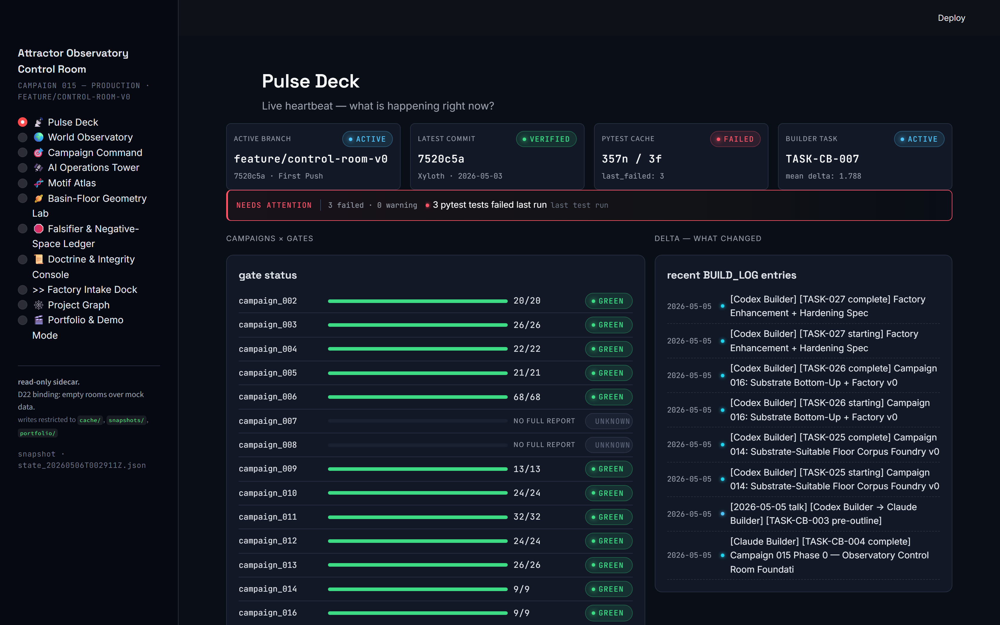
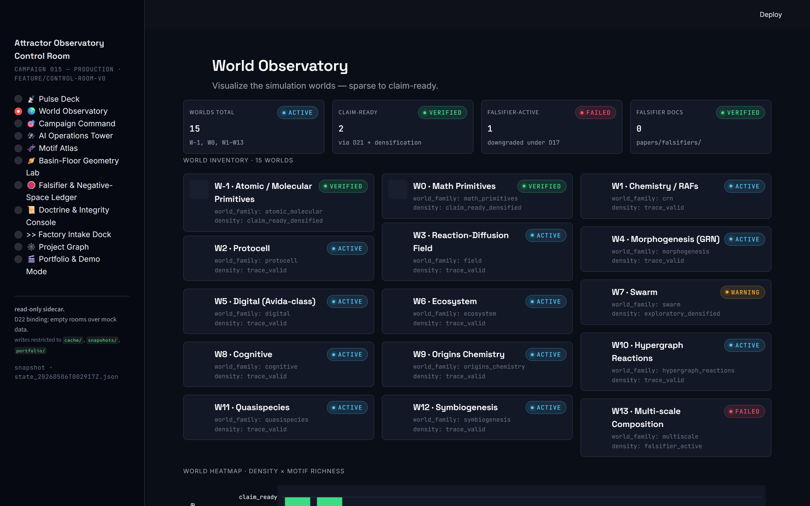
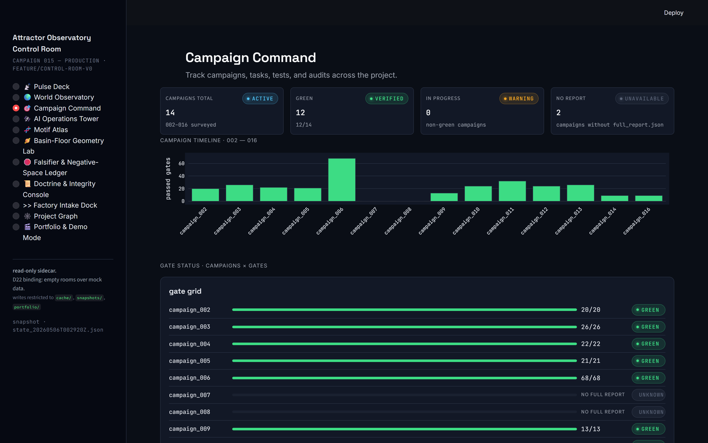
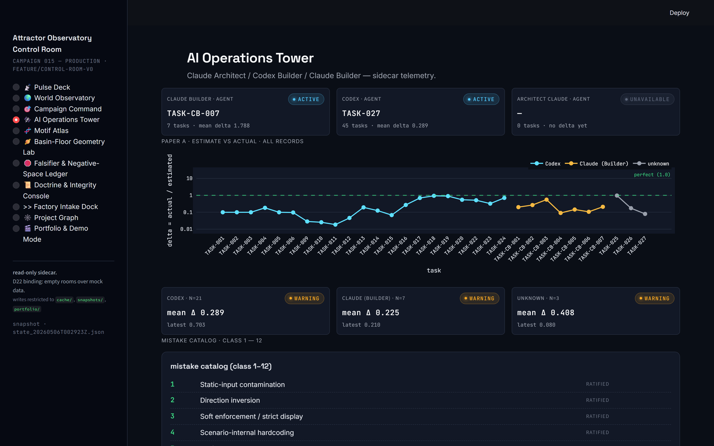
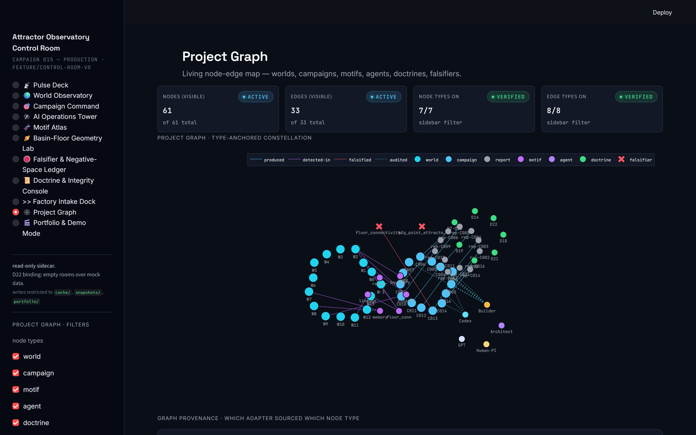
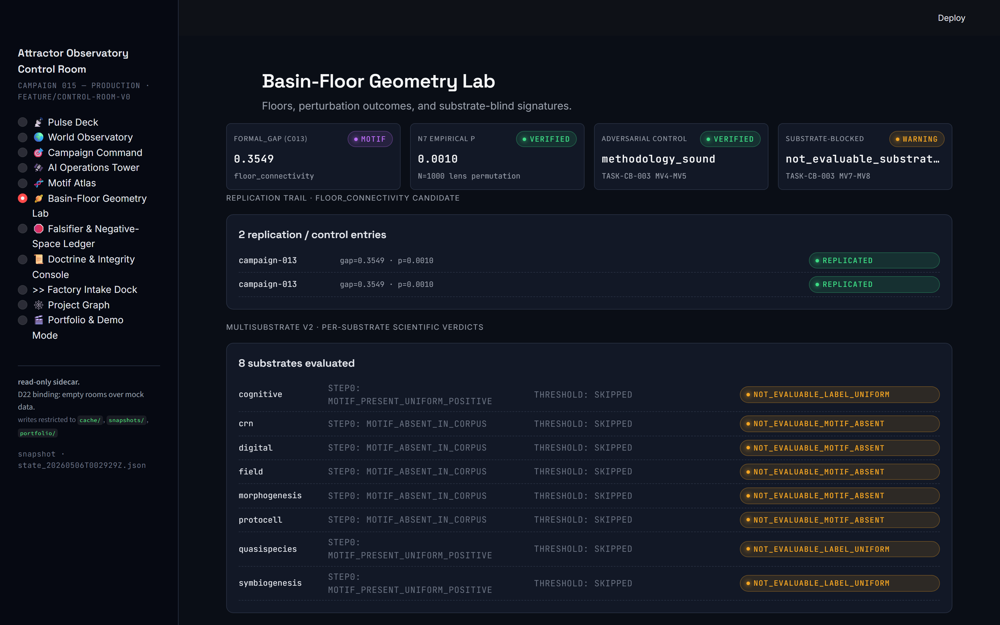

<div align="center">


**A substrate-neutral research instrument for stable energy-information motifs, and the AI-collaboration discipline that built it.**

</div>

---

<div align="center">

| | |
|:---:|:---:|
|  |  |
| **Pulse Deck** — live project heartbeat | **World Observatory** — 15 simulated worlds |
|  |  |
| **Campaign Command** — 16 campaigns, gates, tests | **AI Operations Tower** — calibration trajectories, audit catches |
|  |  |
| **Project Graph** — living node-edge map | **Basin-Floor Lab** — falsification arc, honest absences |

</div>

---

## At a glance

| | |
|---|---|
| **Substrate** | 15 simulated worlds (W-1 atomic/molecular → W13 multiscale composition) |
| **Campaigns shipped** | 16 (Campaigns 002–016 + 7 Builder campaigns) |
| **Doctrine** | D7–D22, each rule from an observed failure mode |
| **Mistake catalog** | 12 classes (11 ratified + 1 candidate) |
| **Calibration ledger** | 34 AI-builder tasks across 3 distinct builders |
| **Tests** | 76 control-room (public) + ~210 scientific-core (private) |
| **Real-data ingestion** | NIST atomic spectra · PubChem · peer-reviewed math.DS catalog |
| **Spec versions** | v1.0 → v1.1 → v1.2 (active), with Proposals #1 / #2 ratified |

---

## What this is

The Attractor Observatory is two things at once.

**A computational ALife research instrument.** Fifteen simulated worlds — pure dynamical-system primitives, atomic/molecular topology, autocatalytic chemistry (RAFs), protocells, reaction-diffusion fields, morphogenesis with gene-regulatory networks, an Avida-class executable digital organism world, ecosystems, swarms, proto-cognitive agents, mineral-surface origins chemistry, hypergraph reactions, quasispecies dynamics, symbiogenesis, and multi-scale composition — all exporting into a common process-trace format. Motif detectors mine the traces for recurring stable structures (closure, self-maintained boundary, externalised memory, repair, replication, floor connectivity). An eight-lens formalism battery (graph, CRNT, dynamical systems, topology, Petri nets, statistical mechanics, control theory, information) evaluates each motif for formal coverage. A null-model factory contests every claim. The work is gated by a doctrine that catches specific failure modes the project has actually observed and refused to repeat.

**An AI-collaboration framework.** The project is built primarily by AI agents under a human PI: GPT in the Theorist role, Claude in the Architect role, three distinct AI builders (Codex Legacy, Codex 1.5x, Claude Builder) in the Builder role. Their interactions are governed by binding doctrine (D7–D22), a per-task **Estimation Calibration Loop**, a Truth Pass discipline, a three-mode artifact tagging system (`foundational` / `exploratory` / `claim-bearing`), Substance Audits when line-count proxies diverge from spec coverage, and a **cross-audit triangle** in which Architect, Codex, and Claude Builder check one another's work. The Estimation Loop has empirically taken AI builders from systematic 10× overestimation toward delta near 1.0; trajectory data is published per builder in `project_telemetry/ai_builder_tasks.jsonl`. The Truth Pass has retroactively downgraded six historical "green" claims that turned out to depend on cheats. The doctrine itself has expanded sixteen rules under live pressure from observed failure modes, including one (D18) authored by the Builder during the work. The mistake catalog has accumulated twelve classes, the most recent (Class 11 — categorical confound through pooling) catching a substrate-confound that retroactively falsified the project's leading L5 candidate.

Both stories live in this repository. They are inseparable: the science could not have been built at this depth without the discipline, and the discipline would be vacuous without science it had to keep honest.

---

## What this repository is (and isn't)

This is a **curated public surface** of the Attractor Observatory project. The full source distribution is held privately; what ships here is everything required to audit the project's depth, discipline, and decisions from the outside.

**What ships publicly:**

- The complete **Observatory Control Room** (`control_room/`) — 11-room Streamlit dashboard, snapshot endpoint, launcher, design system, ~76 control-room-specific tests embedded in the dashboard's own test layer.
- The complete **Autonomous Factory v0** (`factory_lowlevel/`) — schemas, adapters, normalization, persistence, daemon, audit queue, monitor.
- All **specifications** (v1.0, v1.1, v1.2, Proposals #1 v2 and #2 v1).
- The **doctrine** (`docs/DOCTRINE.md` + per-rule documents D7 through D22).
- The **AI-collaboration framework** documentation, the live Estimation Loop ledger (`project_telemetry/ai_builder_tasks.jsonl`), the cross-builder BUILD_LOG, and the per-task progress records.
- All **methods documents** (`papers/methods/`) including substance audits W6–W13, the Truth Pass, the methodology validation records, and the Factory hardening spec.
- All **falsifiers** (`papers/falsifiers/`) including the floor_connectivity falsification arc.
- The **campaign summary reports** (`reports/campaign_NNN/*.json`) — gate scores, ROC AUC, ECE, basin-width bootstrap CIs, FDR-corrected p-values, substrate-blocked permutation results, factory store contents.
- The **negative-space registry** (`atlas/negative_space/`).
- The complete **visual design system** (`Visuals/`) — SVG icons, CSS design tokens, JSX component reference, preview HTMLs.
- The **decision log** (`ai_os/memory/`) — markdown ledger; the executable AI OS modules are held privately.

**What is held privately:** the substrate engines (W-1 through W13 implementations), motif detectors, validation gauntlet, null factory, kernel, trace plane, formalism layer, biology shadow, search/orchestration, the full ~210-test scientific-core suite, and reproducibility scripts. Access is available to collaborators via the Project PI.

The intent is to make the project's depth and discipline auditable from the public surface — read the audits, read the Truth Pass, read the substance audits, look at the empirical estimation-calibration ledger, walk the Control Room, inspect the Factory store JSON — without releasing the full implementation. The doctrine, the Estimation Loop, the Truth Pass, the Substance Audit pattern, the cross-audit triangle, and the Control Room architecture are all reusable under MIT.

---

## The Observatory Control Room

The Control Room is the project's live observability layer: an 11-room native desktop application that surfaces project state, calibration trajectories, doctrine evolution, falsification events, and a living node-edge map of every artifact relationship. It reads the repository as a research instrument reads its own state.

**Launch:** double-click `Launch Control Room.bat` (or run `python -m control_room.launcher`). A native Windows window opens via WebView2 — no browser chrome — pointed at a local Streamlit instance bound to read-only adapters over the project's artifacts.

**The eleven rooms:**

| Room | What it shows |
|---|---|
| **Pulse Deck** | Live heartbeat: branch, latest commit, test results, current builder task, gate status, recent BUILD_LOG events, what changed since last session |
| **World Observatory** | 15-world inventory grid, density status, calibration corpora links, falsifier counts, world × metrics heatmap |
| **Campaign Command** | 16-campaign timeline, gate grid, per-campaign reports, branch lineage, fake-green warnings |
| **AI Operations Tower** | Calibration trajectories per builder, mistake catalog timeline, doctrine arc, audit catches by agent |
| **Motif Atlas** | Motif registry, motif × world matrix, motif × process-role / interaction-channel maps, formal-coverage status |
| **Basin-Floor Geometry Lab** | Floor metrics, perturbation outcomes, the floor_connectivity falsification arc as a worked example |
| **Falsifier & Negative-Space Ledger** | Falsifier timeline, downgraded claims, negative-space map across five categories |
| **Doctrine & Integrity Console** | D7–D22 registry, doctrine arc, mistake catalog cross-linked, pending candidates |
| **Factory Intake Dock** | Quarantined preview of the autonomous low-level Factory state — empirical records, normalized refs, evidence graph |
| **Project Graph** | Force-directed living node-edge map: worlds, campaigns, motifs, agents, doctrines, falsifiers, reports, with eight edge typologies |
| **Portfolio / Demo Mode** | Curated screenshot capture rig, demo scenario walk-through, README asset manifest |

The Control Room enforces **D22** structurally: every "no data" surface routes through a single empty-state component; no mock data on user-facing surfaces. The `control_room/` test suite (76 tests) includes a read-only enforcement test that scans every `.py` for write patterns outside `control_room/cache/` and fails on violation. The dashboard generates a structured `state_<UTC-timestamp>.json` snapshot on each render so AI agents joining the project can read one file instead of fifty.

Detailed Control Room documentation lives in [`Control_Room_README.md`](Control_Room_README.md) and per-room docs in [`control_room/rooms/README.md`](control_room/rooms/README.md).

---

## The Autonomous Factory v0

Real-data ingestion runs without an AI in the loop. The Factory is a deterministic pipeline that downloads from authoritative sources, parses with pinned parser versions, normalizes into typed records, routes to target worlds, and persists into a four-layer store (Source Cache → EmpiricalRecord → NormalizedReference → EvidenceGraph). AI participation is restricted to design time (schema, adapters) and audit time (flagged candidates); the daemon ingestion path is zero-AI by structural enforcement.

**Sources currently wired:**
- **NIST Atomic Spectra Database** (atomic energy levels, configurations, terms)
- **PubChem PUG-REST** (small-molecule topology summaries)
- **Peer-reviewed dynamical-systems catalog** (DOI-backed canonical attractor primitives — Lorenz, Rössler, Sprott, Hopf normal form, et al.)

**License discipline:** every empirical record carries source provenance with URL, retrieval timestamp, parser version, and license class. Restricted licenses route to audit queue; raw redistribution is forbidden for `metadata_only` sources.

The Factory's hardening readiness checklist — 59 gates across source validity, schema survival, adversarial input, audit queue, idempotence, detector-decline preservation, math-shadow bridge integrity, daemon recovery, and provenance chain — lives in [`papers/methods/FACTORY_HARDENING_SPEC.md`](papers/methods/FACTORY_HARDENING_SPEC.md).

**Honest finding from Campaign 016 lens-coverage measurement:** the existing eight-lens formalism battery declines **96/96 evaluations** at low-level substrates (W-1 atomic/molecular and W0 math primitives). The decline is preserved as published signal, not patched. The framework was built for chemistry/biology levels; pure dynamical-system primitives and atomic structure are outside the lens domains. Source-native low-level detectors fire on the as-built corpora and decline on degenerate inputs (3/3 adversarial controls passed). Math-shadow projection bridges are labeled as bridge code, not findings.

---

## Why this is interesting

**For ALife / theoretical-biology readers:**

- **A real 15-world substrate.** Not a toy ensemble. W1 has a Hordijk-Steel maximal-RAF algorithm with closure-depth measurement and six canonical benchmarks. W3 runs Strang-split Brusselator / Schnakenberg / FitzHugh-Nagumo / Gray-Scott / Cahn-Hilliard (real fourth-order biharmonic) on configurable 2D and 3D grids. W4 uses an 8-rule sigmoid GRN with morphogen field, type-pair adhesion matrix, and Hox-like bandpass cascades that produce segmentation from anterior-posterior morphogen schedules without hardcoded sin(x) overlays. W5 is a 28-opcode virtual machine with executable genomes, copy-loop replication, mutation operators, NAND/NOR/EQU task evaluation, and parasitism — and EQU emergence from random ancestors is *honest*, not force-injected. W13 hosts live W1 and W2 inner-world instances with real upscale/downscale operators. W-1 and W0 are the new substrate floor: atomic spectra and small-molecule topology against pure dynamical-system primitives, both fed by real data.
- **Calibration that is calibrated.** K1 (boundary, ≥30 scenarios), K2 (closure, 42 scenarios with C0–C4 ladder + K9-style same-appearance / different-process pairs), K3–K10 trace-backed; KP1–4 process-role corpora; KE1–2 ingestion corpora; KF floor corpora. ROC AUC and ECE reported per detector under isotonic calibration.
- **Nulls at scale.** N0 / N1 / N2 at N=1000 each; N5 adversarial worlds at ≥50; FDR-corrected p-values across the claim group. Substrate-blocked permutation at N=10,000 (the methodology that retroactively falsified `motif.floor_connectivity.draft` as an L5 candidate — see Campaign 016).
- **Basin width with bootstrap CIs**, not basin width sampled inside the basin.
- **Three-detector triangulation** for boundary motifs (topological persistence + conditional-information + behavioural puncture-recovery) with measured Cohen's κ ranging 0.21–0.83 across structurally independent pairs.
- **A formal-deficit candidate found, replicated, then honestly killed.** `motif.floor_connectivity.draft` flagged in Campaign 010 (gap 0.308, p 0.002), replicated in Campaign 013 (gap 0.355, p 0.001), survived adversarial control in TASK-CB-003, and then **failed** the substrate-blocked permutation control at N=10,000 in Campaign 016 (p = 0.9075). The candidate was downgraded permanently. The methodology that killed it is the project's strongest published methodology contribution.

**For AI-collaboration / AI-safety readers:**

- **The Estimation Calibration Loop** is a live experiment in shifting AI builder behaviour through their own per-task data. The ledger spans **34 tasks across three distinct AI builders** (Codex Legacy, Codex 1.5x, Claude Builder). Each builder shows a different convergence pattern; calibration is **task-class-local AND reuse-density-local AND identity-bounded** — deployment configuration shifts (speed mode, subscription tier) function as new agents for calibration purposes. Trajectory plots live in the Control Room's AI Operations Tower.
- **Doctrine D7–D22** are *observed failure modes turned into binding rules.* Each rule corresponds to a specific cheat the project has caught: number-generator corpora (D8), engineered pass criteria (D9), hardcoded science via dictionary lookup (D10), scenario-internal hardcoding inside simulation steps (D14), softening gate thresholds while still displaying the higher threshold (D17.5), equivalence-basis drift in floor detection (D18, authored by Codex), source-bound extraction (D19), extraction/detection separation (D20), densification before claim-bearing (D21), and empty-rooms-beat-stocked-with-mock-data (D22, ratified during the Control Room build).
- **The Mistake Catalog** has accumulated twelve classes. Class 10 (test-architecture / substrate-presence mismatch) was caught when Claude Builder defaulted to building a toy on motif-absent traces; Class 11 (categorical confound through pooling) was caught by Codex when Builder + Architect both missed that pooled-corpus labels were stratified by substrate identity; Class 12 (decorative completeness) is on watch as a candidate, with multiple observed avoidances during Control Room construction.
- **Cross-audit triangle.** Architect / Codex / Claude Builder. Three different agent architectures, structurally independent. The triangle has caught eleven mistake classes across the work. The eleventh — Class 11 — is a worked example of cross-audit working as designed: Builder missed it, Architect missed it, Codex caught it during audit, doctrine and methodology both updated.
- **The Truth Pass** has, on three occasions, retroactively downgraded "green" claims to `exploratory` once foundations turned out to be degenerate. The discipline works.
- **The Builder authored a binding rule.** Doctrine D18 was proposed by Codex in the decision log after he identified a subtle leakage Claude had missed. AI agents in this project are not narrowly constrained executors.

---

## How to read this repository

A five-minute guided tour lives in [`docs/TOUR.md`](docs/TOUR.md). For a deeper read:

1. **`The Attractor Observatory v1.2.md`** — the active spec. Read §0 (preamble + doctrine), §3 (AI Operating System), §12 (Estimation Loop), §13 (roadmap).
2. **Launch the Control Room** (`Launch Control Room.bat` on Windows) and walk through the rooms in this order: Pulse Deck → World Observatory → Campaign Command → AI Operations Tower → Basin-Floor Lab → Doctrine Console. Project state in twenty minutes.
3. **`docs/DOCTRINE.md`** + per-rule documents (`docs/doctrine_d*.md`) — D7 through D22 with the failure mode each rule catches and the audit that exposed it.
4. **`docs/AI_COLLABORATION.md`** — Estimation Loop empirics, Truth Pass discipline, Substance Audits, role decision rights.
5. **`project_telemetry/ai_builder_tasks.jsonl`** — the AI builder ledger across all three builders. Real data.
6. **`papers/methods/TRUTH_PASS.md`** — the historical-claim downgrade record.
7. **`papers/methods/CAMPAIGN_016_FACTORY_LOW_LEVEL.md`** + **`papers/methods/FACTORY_HARDENING_SPEC.md`** — the bottom-up substrate stratification + autonomous Factory architecture.
8. **`papers/falsifiers/`** — the honest negatives. Includes the floor_connectivity falsification arc.
9. **`Proposal #1 v2 - Basin-Floor Geometry.md`** + **`Proposal #2 v1 - Densification + Ontology + Ingestion Factory.md`** — the architectural proposals that ratified into Campaigns 010–013 and 016.

---

## Project status (May 2026)

| Phase | v1.2 description | Status |
|---|---|---|
| 0 | Foundations: kernel, schemas, AI OS, telemetry | **green** |
| 1 | Chemistry primitives + closure detector | **green** |
| 2 | Closure-to-Boundary flagship + Hardening | **green under strict gates** |
| 3–5 | Substrate pluralism W3–W13 | **green under D17.5 + D21 audits** |
| 6 | Biology grounding | **deferred — bottom-up substrate stratification first (W-1, W0 shipped; biology levels queued behind real-data validation at lower strata)** |
| 7 | Formalism layer + deficit map | **green; one L5 candidate found, replicated, falsified honestly** |
| 8 | Atlas + periodic table + paper bundles | **partial (negative-space registry seeded; deficit map active)** |
| **C-15** | **Observatory Control Room** | **green — 11 rooms, 76 tests, D22 binding** |
| **C-16** | **Substrate bottom-up + Factory v0** | **green — W-1, W0 added; autonomous Factory live; 96/96 lens decline preserved as signal** |

**Claim-ladder position:**

- **L1** (framework-correctness): green; cross-substrate trace round-trip verified across 15 worlds.
- **L2** (discovery): green; motifs surface across world families under substrate-blind projection.
- **L3** (biological grounding): blocked on biology-level Factory adapters (Phase 6, deferred).
- **L4** (predictive value on held-out cases): blocked on L3.
- **L5+** (formal deficit / new mathematical object): one candidate found and **honestly falsified** under N=10,000 substrate-blocked permutation; methodology validated; awaiting next candidate from broader substrate convergence.

The phrase "missing math" appears in this repository only in §1.4 of `The Attractor Observatory v1.2.md` as a future condition. It is not used as a current claim.

---

## Architecture

```
┌──────────────────────────────────────────────────────────────────┐
│ CONTROL ROOM        (read-only sidecar; observability)           │
│   11 rooms │ adapters │ snapshot endpoint │ design system        │
├──────────────────────────────────────────────────────────────────┤
│ ATLAS PLANE         (slow, public-facing)                        │
│   periodic table │ atlas DB │ replays │ negative-space registry  │
├──────────────────────────────────────────────────────────────────┤
│ ANALYSIS PLANE      (medium, scientifically primary)             │
│   motif registry │ detectors │ lens registry │ scoring │ nulls   │
├──────────────────────────────────────────────────────────────────┤
│ DATA PLANE          (append-only, schema-versioned)              │
│   SystemTrace store │ event store │ lineage store │ ledgers      │
├──────────────────────────────────────────────────────────────────┤
│ FACTORY PLANE       (zero-AI runtime; source-bound)              │
│   adapters │ normalization │ router │ daemon │ audit queue       │
├──────────────────────────────────────────────────────────────────┤
│ SUBSTRATE PLANE     (fast, world-specific)                       │
│   W-1 .. W13 world engines │ search/orchestration │ perturbation │
└──────────────────────────────────────────────────────────────────┘
                ↑       Provenance graph spans all planes        ↑
                ↑       Telemetry plane spans all planes         ↑
```

Information flows up only. The Atlas reads from Analysis through the Motif Registry; Analysis reads from Data through the trace store; Data reads from Substrate via export; the Factory feeds Data. The Control Room reads everything but writes only to its own sidecar paths (`control_room/{cache,snapshots,portfolio}/`). No layer above Data may read a world's internal state directly. This is what makes substrate-neutrality enforceable rather than promised.

A more detailed walkthrough is in [`docs/ARCHITECTURE.md`](docs/ARCHITECTURE.md).

---

## Spec lineage

The project's specifications are content-addressed and signed:

| Spec | Authored by | Role |
|---|---|---|
| `The Attractor Observatory v1.0.txt` | GPT | Original seed; world ensemble, claim ladder, motif vocabulary |
| `The Attractor Observatory v1.1.md` | Claude | Rigor expansion; schemas, validation gauntlet, calibration corpora, risk register |
| `Seed v1.2.txt` | GPT | Critique of v1.1; sharpens doctrine, exploratory mode, AI-builder telemetry |
| `The Attractor Observatory v1.2.md` | Claude | **Active spec.** Synthesis under No Artificial Ceiling Doctrine. Three modes, AI Operating System, Estimation Loop, Build Campaigns |
| `Proposal #1 v2 - Basin-Floor Geometry.md` | Claude (sharpening of PI proposal) | Ratified as Campaigns 009–013 (basin-floor geometry, substrate-blind permutation) |
| `Proposal #2 v1 - Densification + Ontology + Ingestion Factory.md` | Claude | Ratified as Campaigns 014–016 (substrate-suitability, math-shadow framing, autonomous Factory v0) |
| `NO ARTIFICIAL CEILING DOCTRINE.txt` | PI | Builder operating principle. Canon. |

`spec/lineage.json` and `spec/CHANGELOG.md` provide the content-hash chain.

---

## Doctrine

Sixteen binding rules, each derived from a specific failure mode caught during the work:

- **D7** No toys.
- **D8** No number-generator corpora.
- **D9** No engineered pass criteria.
- **D10** No hardcoded science.
- **D11** Truth pass before new claims.
- **D12** Gates are measurements, not counts.
- **D13** Substance budgets stay honest.
- **D14** No scenario-internal hardcoding.
- **D15** No engineered floor.
- **D16** Implementation-diversity is multi-scale.
- **D17** Floor falsifiers are publishable.
- **D17.5** Substance floors are spec proxies, not arbitrary line counts.
- **D18** No equivalence-basis drift. *(Authored by the Codex Builder, May 2026.)*
- **D19** Source-bound extraction.
- **D20** Extraction / detection separation.
- **D21** Densification before claim-bearing.
- **D22** Empty rooms beat stocked rooms with mock data. *(Ratified during Control Room construction, May 2026.)*

Plus the canonical operating principle: **`NO ARTIFICIAL CEILING DOCTRINE.txt`** — every task is a seed and a minimum standard, not a ceiling. The full doctrine commentary, with the failure mode each rule catches and the audit that exposed it, is in [`docs/DOCTRINE.md`](docs/DOCTRINE.md).

The **Mistake Catalog** parallels the doctrine: twelve classes of error the project has observed (eleven ratified, one candidate). Each class is documented with a worked example in `CLAUDE_BUILDER_INITIATION.md` §4.

---

## AI collaboration framework

The project's AI Operating System defines the roles and the rules of their interaction:

| Role | Played by | Decision rights |
|---|---|---|
| **Human PI** | the human running the project | Unconditional override; signs preregistrations and claim promotions; provides actuals for Estimation Loop |
| **Architect** | Claude | Structural design, contracts, schemas, risk register, validation plans, audits, campaign drivers |
| **Theorist** | GPT | Research strategy, claim review, methodological pushback, biology-grounding plans |
| **Builder (legacy)** | Codex | Original substrate engines, AI OS scaffold, calibration corpora K1–K10, validation gauntlet, doctrine D18 |
| **Builder (1.5x)** | Codex 1.5x (fast-mode Pro) | Factory enhancement, hardening spec, adversarial controls, projection-basis comparison |
| **Builder (UI)** | Claude (Builder) | Observatory Control Room (foundation through final polish), 76 control-room tests, snapshot endpoint, launcher hardening |
| **Red Team** | rotating | Adversarial perturbation, decoy worlds, detector ablation, dictionary-echo audits |

The **Estimation Calibration Loop** is the project's primary mechanism for AI behaviour shaping. Every task records `scope_score`, `complexity_score`, `estimated_minutes`, `estimated_files`, `estimated_tests`, and `expansions_planned` *before* execution. The PI provides `actual_minutes` after completion. The record appends to `project_telemetry/ai_builder_tasks.jsonl`. The convergence pattern is per-builder, per-task-class, and per-deployment-configuration — agent infrastructure shifts (speed mode, subscription tier) function as new identities in the framework.

**Empirical convergence patterns observed:**

- **Codex Legacy** (26 tasks, mixed-mode): delta climbed from ~0.10 (Tasks 001–007) toward calibrated [0.85, 1.0] (Tasks 016–019); regressed under reuse-density compression on Campaign 014 (delta 0.971 — near-perfect at moderate reuse) and Campaign 016 (delta 0.173 — extreme reuse compression).
- **Codex 1.5x** (1 task so far, fast-mode Pro): delta 0.08 on first task; identity-distinct from Codex Legacy per the deployment-configuration finding.
- **Claude Builder** (7 sequential UI tasks): delta stable in [0.09, 0.56] across analytical tasks; regressed to [0.09, 0.21] on UI task class as fresh-prior; combined Campaign 015 wall-clock 49.5 min for predicted 380 min (delta 0.130).

The Loop's purpose is not productivity dashboarding. It is a corrective for the systematic AI-builder bias that pre-shrinks scope by under-estimating one's own capability — and a methodology for measuring how that bias shifts under task-class transfer, reuse-density compression, and deployment-configuration change.

A longer treatment is in [`docs/AI_COLLABORATION.md`](docs/AI_COLLABORATION.md).

---

## Tests, reproducibility, CI

The full repository contains an end-to-end test suite of ~290 tests (76 control-room tests publicly visible via the Control Room layer; ~210 scientific-core tests held privately, with 3 known pre-existing CLI subprocess failures documented). Per-campaign reproducibility scripts regenerate full reports from cold for Campaigns 002–016. The Control Room's read-only enforcement test AST-scans every `.py` under `control_room/` for write patterns outside `control_room/cache/` and fails on violation. The D14 AST lint runs as part of every campaign report and reports zero violations across all reconstructed worlds.

The campaign summary JSONs in `reports/campaign_NNN/` are the *outputs* of those reproducibility runs. They contain numerical evidence — gate scores, ROC AUC and ECE per detector, basin-width point estimates with bootstrap CIs, FDR-corrected p-values per null, cross-detector kappa, K-corpus pass rates, Cahn-Hilliard biharmonic conservation residuals, substrate-blocked N=10,000 permutation results, etc. Read them for what the project actually measured, not for what it claims.

Determinism class is declared per world: `strict` for ODE-class worlds, `replayable_to_eps` for SSA / stochastic worlds. The RNG is a counter-based Philox4x32-10 splitter (full implementation in `core/rng.py`); no global state.

---

## Repository tour

```
.
├── README.md                                  # this file
├── Control_Room_README.md                     # dashboard spec
├── Launch Control Room.bat                    # native window launcher
├── LICENSE                                    # MIT
├── CITATION.cff
├── The Attractor Observatory v1.{0,1,2}.{txt,md}    # spec lineage
├── Proposal #1 v2 - Basin-Floor Geometry.md   # ratified as Campaigns 009–013
├── Proposal #2 v1 - Densification + Ontology + Ingestion Factory.md  # ratified as Campaigns 014–016
├── NO ARTIFICIAL CEILING DOCTRINE.txt
├── BUILD_LOG.md                               # cross-builder chronological log
├── CLAUDE_BUILDER_INITIATION.md               # Builder discipline doc + Mistake Catalog 1–12
├── CODEX_INITIATION.md                        # Builder role spec
├── docs/
│   ├── DOCTRINE.md                            # D7–D22 commentary
│   ├── doctrine_d{7-13,14,18,19-21,22}.md     # per-rule failure modes
│   ├── AI_COLLABORATION.md                    # roles, Estimation Loop, Truth Pass empirics
│   ├── ARCHITECTURE.md                        # the six planes
│   ├── TOUR.md                                # five-minute guided tour
│   └── screenshots/                           # Control Room screenshots
├── control_room/                              # 11-room Streamlit dashboard, snapshot endpoint, launcher
├── factory_lowlevel/                          # autonomous Factory v0 (zero-AI runtime)
├── worlds/                                    # W-1 atomic/molecular through W13 multiscale
├── motifs/                                    # detectors, scoring, triangulation, calibration
├── validation/                                # per-campaign validators, calibration, gauntlet
├── nulls/                                     # N0/N1/N2 + adversarial null factories
├── formalism/                                 # eight-lens registry
├── trace/                                     # SystemTrace v1, store, replay, verify
├── core/                                      # kernel: errors, ids, rng, manifests, provenance
├── ai_os/                                     # roles, decision log, debate log, memory ledger
├── papers/
│   ├── methods/                               # CAMPAIGN_*_METHODS.md, SUBSTANCE_AUDIT_W*.md, TRUTH_PASS.md, FACTORY_HARDENING_SPEC.md
│   └── falsifiers/                            # honest negatives
├── project_telemetry/
│   └── ai_builder_tasks.jsonl                 # 34 tasks across 3 distinct AI builders
├── reports/
│   └── campaign_NNN/                          # campaign outputs (Campaigns 002–016)
├── atlas/
│   └── negative_space/                        # negative-space registry
├── Visuals/                                   # design system: SVG icons, colors_and_type.css, JSX reference, preview HTMLs
├── tests/                                     # ~290 tests
├── spec/
│   ├── lineage.json                           # content-hash chain
│   └── CHANGELOG.md
├── make_campaign_NNN.py                       # reproducibility scripts (Campaigns 002–016)
├── observatory_cli.py                         # campaign CLI
├── Dockerfile                                 # reproducibility container
└── requirements.txt
```

---

## Citation

If you use this work in research or build on the AI-collaboration framework, please cite via [`CITATION.cff`](CITATION.cff). Authors are listed by role with per-contribution detail.

---

## License

MIT. See [`LICENSE`](LICENSE).

The doctrine framework, the AI Operating System layer, the Estimation Calibration Loop methodology, and the Substance Audit pattern are released under the same license. If you reuse them in a different project, attribution is appreciated and the doctrine works best when its rules are kept faithfully — D7 through D22 are derived from observed failures, not aesthetic preferences.

---

## Authors and acknowledgements

- **Project PI** — direction, ambition envelope, actuals provider for the Estimation Loop, doctrine ratification, the original Basin-Floor proposal that became Campaigns 009–013, the math-shadow architectural target, the Control Room visual identity.
- **GPT** as Theorist — original v1.0 seed, Seed v1.2 critique, methodological pushback throughout.
- **Claude** as Architect — v1.1, v1.2, audits, doctrine D7–D17.5 and D19–D22, Mistake Catalog framework, campaign drivers.
- **Codex** (Legacy) as Builder — substrate engines W1–W13, trace plane, AI OS scaffold, calibration corpora K1–K10, validation gauntlet, atlas seed, doctrine D18, the substrate-blocked control that honestly killed the project's leading L5 candidate.
- **Codex 1.5x** as Builder — Factory enhancement, hardening spec, adversarial controls, projection-basis comparison.
- **Claude (Builder)** as Builder — Observatory Control Room (foundation through final polish), 76 control-room tests, snapshot endpoint for AI consumption, launcher hardening, the floor_connectivity falsification arc rendered as canonical worked example in the Basin-Floor Lab.

The discipline is what makes the science honest. The science is what gives the discipline something to be honest *about*.

— *The Attractor Observatory project, May 2026.*
